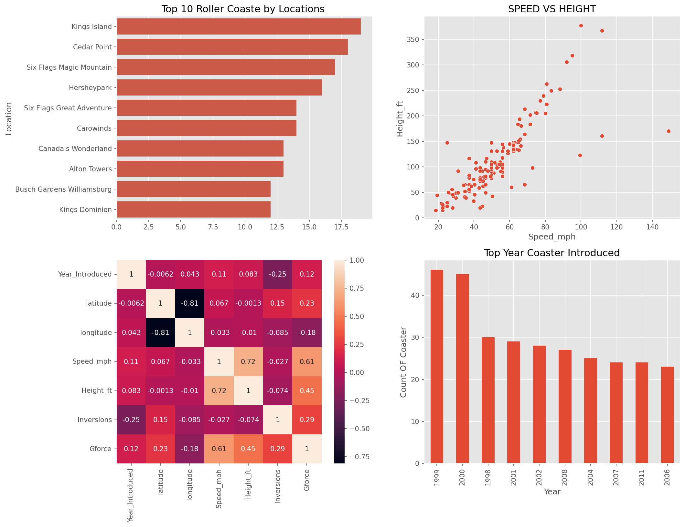
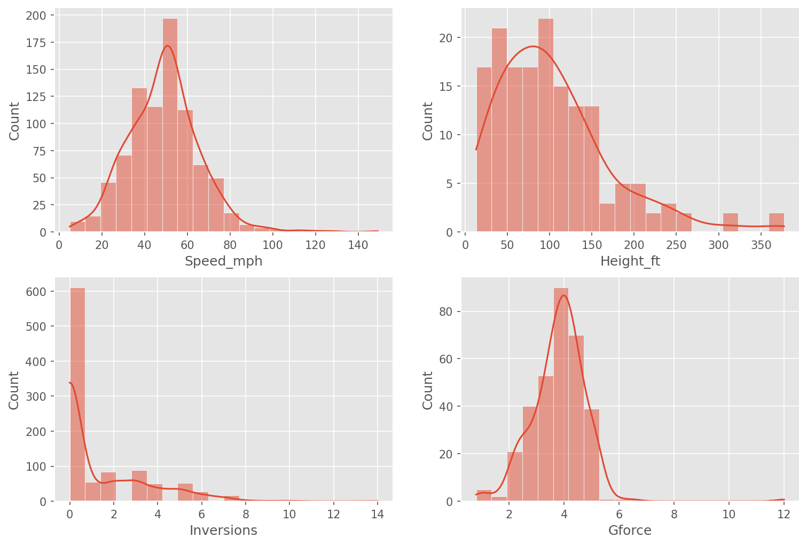

# 🎢 Roller Coaster Data Analysis (EDA)

This project performs **Exploratory Data Analysis** on a roller coaster dataset to understand patterns in ride characteristics such as speed, height, length, and trends over time.

## Project Objective

Analyze roller coaster data using visualization techniques  
Understand relationships between key features  
Identify trends in coaster design  
Prepare data for machine learning models  

## Dataset Features

Name  
Location  
Year of Introduction  
Speed  
Height  
Length  
Number of Inversions  
Manufacturer  

## 📊 Visualizations

### Dashboard 1

### Dashboard 2

## Key Insights

1. Modern roller coasters are generally **faster and taller**  
2. Strong relationship between **height and speed**  
3. Longer rides indicate **greater track length**  
4. Presence of **outliers** representing extreme coasters  

## 🛠 Tools Used

- Python  
- Pandas  
- NumPy  
- Matplotlib  
- Seaborn  

## Future Task

Apply machine learning models  
Perform feature engineering  
Build predictive models  

## Conclusion

EDA helps in understanding the dataset, identifying patterns, and preparing data for machine learning applications.

## 👨‍💻 Author

**Sourabh**  
GitHub: https://github.com/sourabh9098
